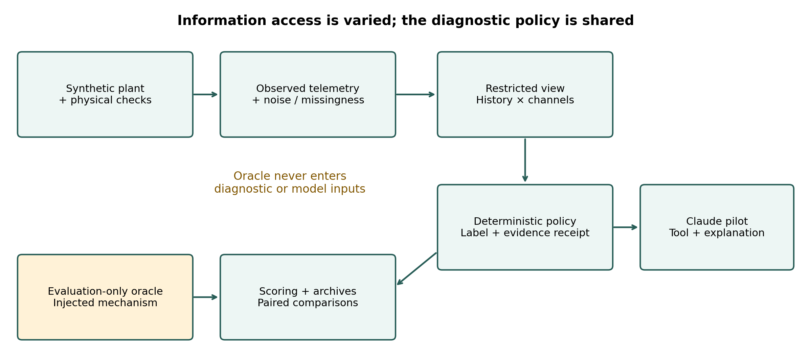
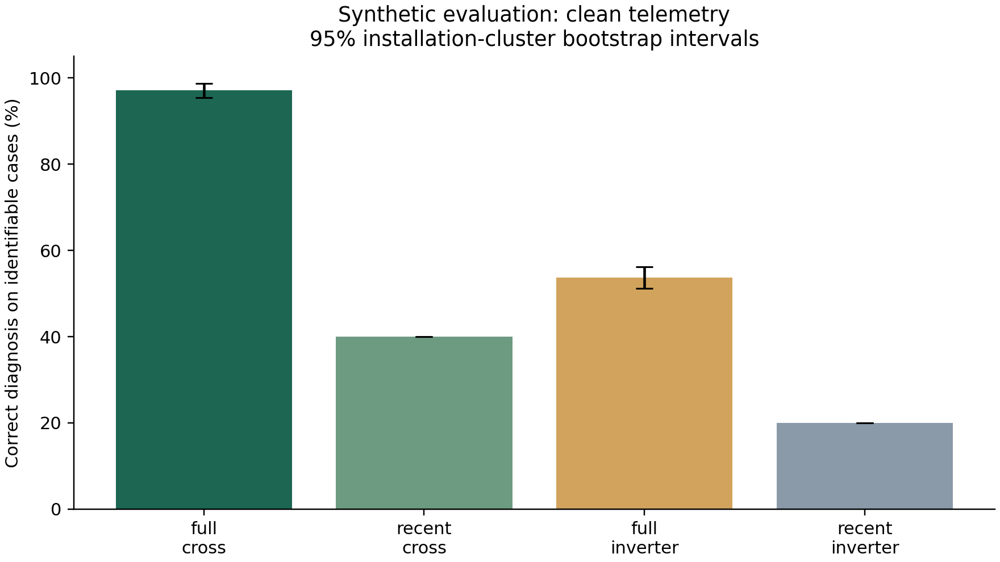
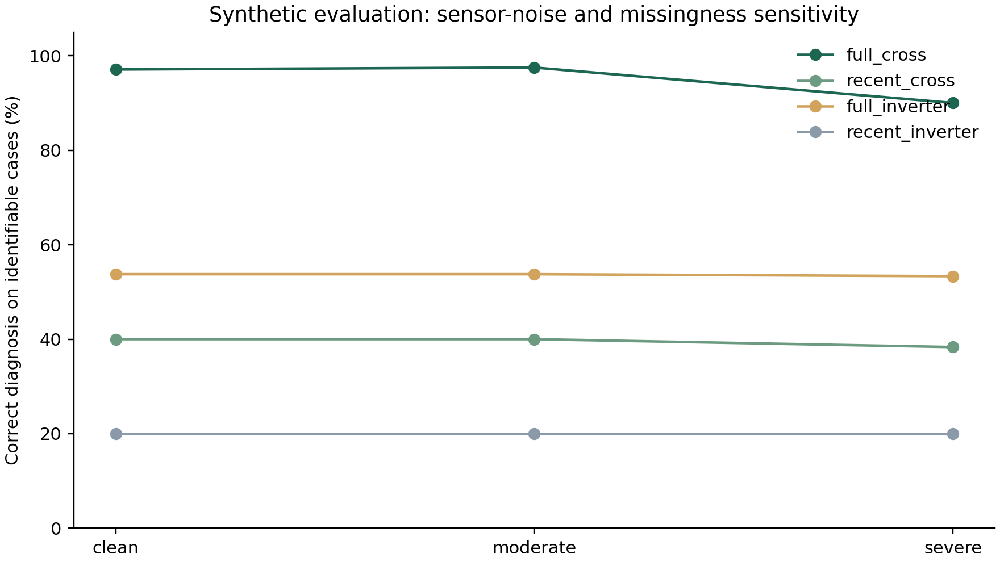

# Evaluating historical and cross-component evidence for conversational solar-system diagnostics: a synthetic study

Oyewale, D.O.¹ and Meyer-Petgrave, F.¹

¹Petgrave.io Technologies Ltd, Nigeria

## Abstract

Solar monitoring telemetry can support diagnostic explanations, but the value of combining installation history with measurements from multiple components requires explicit evaluation. This study presents an evidence-producing diagnostic architecture for the Intelligent Data Logger and evaluates information access through controlled synthetic experiments. A physically checked PV–battery–load simulator generated twelve matched episodes for each of 24 evaluation installations, separate from eight development installations. A shared deterministic policy was evaluated under four combinations of historical/recent-only and cross-component/inverter-only access, with clean and corrupted observations, producing 3,456 paired predictions. On identifiable clean-data cases, full historical and cross-component access achieved 97.1% correct diagnoses (95% installation-cluster bootstrap interval: 95.4–98.8%), compared with 53.8% for historical inverter-only access and 40.0% for recent-only cross-component access. Accuracy decreased to 90.0% under severe observation corruption. Restricted conditions frequently abstained on tasks requiring unavailable evidence, making coverage essential to interpretation. A separate 24-conversation Claude development pilot selected the intended tool in every conversation, but all responses failed the strict JSON-output requirement. Post-hoc removal of Markdown fences recovered 24 receipt-consistent labels; only 15 responses satisfied the measurement-name citation rule. The results support a task-dependent role for persistent, cross-component evidence while exposing interface-contract and citation failures in the conversational layer. The comparisons are shared-policy information ablations, not optimized competing systems. Project-authored synthetic data, shared modelling assumptions and the absence of field validation limit generalization. Independent-data evaluation and physical deployment remain future work.

Keywords: solar diagnostics, synthetic telemetry, operational history, evidence grounding, conversational interfaces

## 1. Introduction

A solar installation combines photovoltaic generation, conversion, storage, demand and grid exchange. A change in one observed signal can have several explanations: reduced output may reflect lower irradiance, conversion loss, or a changing operating regime. A useful diagnostic interface must therefore identify which measurements support its explanation and when the available record cannot resolve the question. This motivates a persistent installation record and a conversational layer that reports engineering evidence in accessible language.

Established photovoltaic modelling already represents environmental effects on output [1,2], and degradation analysis already exploits longitudinal records while addressing confounding effects [3]. Language-model tool use is also established [4,5]. The contribution claimed here is narrower than inventing these components: an implemented, auditable solar diagnostic architecture and a controlled examination of how its access to history and component measurements affects task resolution. We distinguish the deterministic diagnostic result from the language model's ability to retrieve and report that result.

The intended application is evidence-supported interpretation for owners and installers, including settings relevant to solar adoption in Nigeria. However, the present study contains no Nigerian field measurements, hardware prototype, installer assessment or deployment trial. It tests an architectural hypothesis using explicitly synthetic data. The research questions are: (RQ1) how does historical access affect correct resolution of identifiable cases; (RQ2) how does cross-component access affect resolution and false positives; and (RQ3) how sensitive are these outcomes to observation noise and missingness? A separate development pilot examines tool selection, structured-output compliance and evidence-reference validity.

## 2. Related work and contribution boundary

The Sandia photovoltaic array performance model describes electrical, thermal and optical behaviour for performance prediction and measurement comparison [1]. The pvlib python software provides reusable solar-energy modelling implementations [2]. These works establish a substantial modelling foundation; our deliberately simplified project-authored generator does not replace their physical detail or inherit their validation. It provides matched interventions for an information-access experiment, with physical consistency checks and disclosed assumptions.

Jordan et al. [3] developed a degradation methodology addressing operational confounders using clear-sky irradiance and year-over-year analysis, demonstrated on a fleet of 486 PV systems. Accordingly, history-dependent PV diagnosis and weather normalization are not novel claims of this paper. Our 60-day synthetic decline task is a controlled signature test, not an annual field degradation estimator. No performance comparison with RdTools is made.

ReAct combines language-model reasoning and actions to obtain external information [4]. Toolformer studies learning to select and use APIs [5]. Our system instead uses an existing tool-capable model with a small, fixed engineering-tool interface. The pilot forces one tool call and then requests a structured explanation; it does not reproduce those training methods or establish autonomous diagnostic reasoning. The computational boundary keeps engineering quantities in deterministic code and exposes their provenance to the conversational layer.

Selective classification illustrates why performance on answered cases must be interpreted together with coverage [6]. We apply that distinction descriptively to a deterministic policy with explicit unknown outcomes, without claiming the statistical risk guarantees of selective-classification methods. Our contribution is the combined reproducible access ablation, evidence receipts and failure-transparent conversational pilot. This targeted comparison of primary sources does not establish an exhaustive literature gap or a first-of-its-kind system.

## 3. Materials and methods

### 3.1 Architecture and evidence boundary

The pipeline separates clean physical trajectories, corrupted observations, condition-specific access, deterministic diagnosis and oracle-based evaluation. The oracle stores injected causes and simulation parameters solely for scoring. The diagnostic function receives an allowed telemetry view, legitimate nameplate information, a task and fixed thresholds; it has no file access or simulator import. It produces a label, explanation of the decision, measurement dictionary, available columns, time window and thresholds. No scenario identifier, seed, latent state, oracle label or future row is supplied to it.

The conversational layer selects an approved tool and receives its receipt rather than raw time series. The operational dashboard displays the latest complete stored synthetic snapshot and supports investigations. A separate public experiment explorer presents archived evidence and comparative results. Neither a website interaction nor an interface screenshot is counted as a research trial. Figure 1 summarizes the evaluation boundary.

### 3.2 Simulator and sampling

Eight development installations (seeds 100–107) and 24 evaluation installations (1000–1023) use disjoint random seeds. Each installation contributes twelve matched episodes, each with 60 days at 15-minute cadence (5,760 timestamps). Evaluation therefore contains 288 episodes and 1,658,880 timestamp rows, with 24 installation-level sampling units. Matched episodes reuse installation parameters and underlying stochastic conditions to isolate interventions; they are not 288 independent installations.

PV rating varies uniformly from 3 to 9 kWp; inverter rating derives from a PV/inverter ratio of 1.05–1.45. Nominal battery capacity varies from 5 to 15 kWh, with 90% represented as usable capacity. Conversion efficiency varies from 0.90 to 0.98 and charge/discharge efficiencies from 0.91 to 0.98. Temperature coefficients vary from 0.003 to 0.005 per degree Celsius. Demand scale, initial battery energy, power limits, cloud variation, intervention severity and alarm timing also vary. These are design assumptions, not fitted distributions for Nigerian installations.

The generator uses a clipped sinusoidal daylight profile, daily cloud variation and autocorrelated short-term cloud perturbations. PV power depends on irradiance, temperature, conversion efficiency and the injected performance factor, capped at inverter rating. Fault effects precede dispatch. For each interval, PV and battery discharge plus grid imports balance served load, battery charging and exports. Battery energy evolves using interval duration and charge/discharge efficiencies. Independent numerical checks verify AC energy balance, battery transitions, SOC and power limits before telemetry corruption. All 288 clean evaluation trajectories passed these checks. This establishes internal consistency, not validation against a physical plant.

The twelve episodes comprise three daily-output cases (normal, weather attenuation and conversion loss), four alarm cases (none, overload, thermal stress and unexplained), four longitudinal cases (stable, declining conversion performance, declining irradiance and static low efficiency), and one unavailable-telemetry case. Five of the ten identifiable episodes are normal/control cases. Unexplained alarms and unavailable telemetry require abstention. Generic alarms do not disclose their causes. The comparative study does not evaluate the original demonstration's battery-health, financial or islanding functions.

### 3.3 Information-access conditions and diagnostic policy

Table 1 defines a matched 2 × 2 design. All conditions share the same questions, nameplate ratings, query times and deterministic policy. Cross-component views contain inverter AC output, temperature and alarm, plus irradiance, ambient temperature, load, battery SOC, battery charge/discharge and grid import/export. Inverter-only views contain timestamp and the three inverter channels. An explicit allowlist and timestamp filter enforce access before diagnosis.

Table 1. Matched information-access conditions.

| Condition | Historical access | Measurement access |
|---|---|---|
| Full cross-component | All 60 days to query time | Inverter plus weather, load, battery and grid |
| Recent cross-component | Last 24 hours | Same cross-component channels |
| Full inverter-only | All 60 days to query time | AC output, inverter temperature and alarm |
| Recent inverter-only | Last 24 hours | Same inverter-only channels |

The daily-output tool examines 09:00–16:00 observations and, when available, compares them with preceding days. Cross-component normalization adjusts nameplate output for measured irradiance and temperature, excludes irradiance at or below 200 W/m² and near-clipping output, and requires sufficient valid observations. A relative normalized loss above 15% supports conversion loss; irradiance loss above 20% with preserved normalized performance supports weather loss. Without a historical baseline, sufficiently low absolute normalized performance can support conversion loss; otherwise the tool can abstain.

Alarm diagnosis checks for above-rating load before the generic alarm, using at least 30 minutes of overload as its criterion; alternatively, inverter temperature at or above 75°C supports a thermal explanation. An unexplained alarm remains unknown. Longitudinal diagnosis requires at least 14 valid days, compares early and late daily summaries, and uses a 5% decline threshold. It normalizes for weather only when those channels are available. Required-input coverage must be at least 80%. These policy-specific thresholds were internally frozen before the evaluation run; the protocol was not externally preregistered.

The cross-component bundle varies weather and load availability together with other channels. Thus this design estimates the effect of the bundle under this policy, not separate causal contributions of every battery or grid measurement. These are information ablations, not independently optimized competitor algorithms. No manual-dashboard or installer baseline was simulated.

### 3.4 Observation stress, outcomes and uncertainty

Moderate stress adds independent multiplicative Gaussian numeric-meter noise with 3% standard deviation and 1% missingness; severe stress uses 8% noise and 5% missingness. All four access conditions receive the same corrupted realization. Missingness is independent across numeric readings and does not reproduce every real communication or sensor fault. Corrupted readings are not expected to satisfy exact physical balance. Four conditions and three stress levels yield 3,456 predictions; stress levels remain separate in analysis.

The primary endpoint is correct diagnostic label on ten identifiable cases per installation. Unknown on such a case counts as unresolved. Coverage is the fraction of all twelve cases receiving a non-unknown label. Selective accuracy is correctness among non-unknown answers, averaged within installations. We also report abnormal predictions on five normal/control cases and correct abstention on the two ambiguous/unavailable cases. Each metric is computed per installation and then averaged; 95% percentile intervals use 2,000 whole-installation bootstrap draws with a fixed seed. Paired contrasts use the same draws. Intervals describe within-simulator variability, not field performance; no formal significance test is claimed.

### 3.5 Live-model development pilot

The frozen live protocol uses seed 100, all twelve episodes and two extreme access conditions: full cross-component and recent inverter-only. Claude Sonnet 4.5 (claude-sonnet-4-5-20250929) operates at temperature zero with at most 700 output tokens per request, two requests per conversation, no automatic retries and a USD 3 reservation limit. The first request forces selection of one of three tools; the second requests only a JSON object containing label, explanation and cited measurement names. The model receives no oracle labels. A total of 24 conversations and 48 requests completed on 28 September 2026.

Primary checks retain the original strict JSON parser and separately record tool selection, label fidelity, oracle agreement, citation-name validity and nonempty explanation. After observing fenced responses, a supplementary sensitivity analysis removed exactly one enclosing Markdown fence and reapplied the same scorer. This was post-hoc and exploratory. It did not replace primary results or trigger additional generation. Earlier workspace-authentication and connection failures remain archived. Qualitative assistant inspection of prose is distinguished from independent human assessment.

## 4. Results

### 4.1 Clean-data information access

Table 2 reports clean-data results. Full historical and cross-component access resolved 233 of 240 identifiable cases correctly (97.1%; 95% interval 95.4–98.8%). Its paired difference was 57.1 percentage points versus recent cross-component access (55.4–58.8) and 43.3 points versus full inverter-only access (40.8–45.8). The factorial interaction was 23.3 points (20.8–25.8). These differences concern the fixed policy and authored task mix.

Table 2. Clean-data outcomes (%); 24 installations, 240 identifiable and 48 abstention-required cases per condition. Intervals are installation-cluster bootstrap intervals.

| Access condition | Correct diagnosis [95% interval] | Coverage | Selective accuracy | False positives |
|---|---:|---:|---:|---:|
| Full cross-component | 97.1 [95.4, 98.8] | 83.0 | 97.5 | 0.8 |
| Full inverter-only | 53.8 [51.3, 56.2] | 58.7 | 76.4 | 19.2 |
| Recent cross-component | 40.0 [40.0, 40.0] | 33.3 | 100.0 | 0.0 |
| Recent inverter-only | 20.0 [20.0, 20.0] | 16.7 | 100.0 | 0.0 |

Acute alarm accuracy was 100% for both cross-component conditions: extended history was unnecessary for these constructed events. Recent-only conditions abstained throughout the longitudinal task because one day did not meet the temporal evidence requirement. Their perfect selective accuracy coexisted with low coverage. Zero-width intervals reflect identical simulated installation scores, not certainty about a population. Always predicting normal would score 50% on the primary endpoint because five of ten identifiable cases are controls, while missing every identifiable abnormal case. This sanity check emphasizes task-level and coverage reporting rather than supplying a fitted comparator.

The full condition missed five gradual declines, classified one normal day as weather loss and left one normal day unresolved. These seven failures remain included. Inverter-only history sometimes confused weather-related output change with PV decline. A control-day weather-loss response also illustrates a label limitation: natural stochastic weather variation can occur when no weather intervention was injected. An injection-label disagreement therefore does not always imply an incorrect description of observed conditions.

### 4.2 Observation stress and abstention

Full cross-component accuracy was 97.5% under moderate corruption (95.4–99.2%) and 90.0% under severe corruption (87.1–92.9%). The slight increase under moderate noise is retained: individual threshold crossings can help or harm label agreement. It is not evidence that noise improves diagnosis generally. All conditions abstained on all 48 deliberately ambiguous/unavailable cases per stress level. This covers two authored mechanisms, not general uncertainty calibration or a safety guarantee.

### 4.3 Conversational pilot and output-contract failures

All 24 conversations completed, and the intended tool was selected in every case. However, every final answer enclosed its JSON in Markdown code fences. The frozen strict parser therefore accepted 0/24 outputs, and downstream primary structured checks received no credit. Completion is consequently not equivalent to successful end-to-end operation.

Table 3. Live development pilot: primary strict scores and explicitly post-hoc fence-removal scores. Denominator is 24 conversations throughout.

| Check | Primary strict evaluation | Post-hoc fence removal |
|---|---:|---:|
| Intended tool selected | 24/24 | Not re-evaluated |
| JSON accepted | 0/24 | 24/24 |
| Label matches tool receipt | 0/24 | 24/24 |
| Label matches evaluation oracle | 0/24 | 16/24 |
| All citations are receipt measurement names | 0/24 | 15/24 |
| Nonempty explanation parsed | 0/24 | 24/24 |

After fence removal, full cross-component labels matched the oracle in 12/12 conversations and recent inverter-only labels in 4/12. These counts include abstention-required cases and are not the offline primary endpoint. Nine responses cited at least one telemetry column, threshold or receipt field outside the allowed measurement-name dictionary. A string appearing elsewhere in a receipt did not satisfy the prespecified citation rule.

Estimated token cost was USD 0.2130, using the protocol's rates; this is not an independently reconciled invoice. Median recorded conversation duration was 6.263 seconds (range 4.184–37.639). Qualitative inspection flagged explanations that generalized zero alarm samples to all telemetry being normal, described all channels as examined, or treated a channel excluded by design as missing observed data. These are examples for independent review, not a blinded or quantitatively validated prose-quality assessment. Numerical fidelity throughout explanations remains unevaluated.

## 5. Discussion

The study supports a task-dependent architectural argument. A temporal comparison requires history, while weather and load context can separate mechanisms that look similar in inverter output. The successful acute cases show that longer history is not always needed. The aggregate improvement should therefore be interpreted alongside the deliberate selection of history-dependent and context-dependent tasks, the normal-case proportion and the restricted conditions' abstentions.

The live pilot identifies a different engineering problem. A model can select the right tool and preserve its label while violating the machine-readable output contract and citation schema. A polished interface alone would conceal this distinction. Strict parsing, validation of cited identifiers, preservation of raw outputs and explicit separation of primary and exploratory analyses make these failures inspectable. Future schema-constrained generation or parser revisions require a new protocol and fresh evaluation rather than retroactive success claims for this run.

The public explorer communicates two evidence levels: the original single-installation M1–M6 feasibility demonstration and the separate multi-installation access study. It includes the outage trace and raw evidence links, while the local dashboard supports conversation. This separation permits a public, static demonstration without distributing API credentials or implying that a recorded page is connected to a live solar system. Usability and the effect of explanations on installer decisions have not been measured.

Several limitations constrain the findings. The simulator and policy share authorship and broad mechanisms, creating inverse-model optimism. Disjoint seeds test stochastic variation within the same generator rather than unseen fault families or independent physics. The simplified daylight, temperature and dispatch models are not validated against field data; corruption covers only limited noise and missingness mechanisms. Recent-only policy paths are intentionally conservative, and optimized alternatives could perform better. Oracle labels identify injected mechanisms rather than universally adjudicated engineering diagnoses. The pilot has one development seed, one model pass and forced tool use; it does not test autonomous evidence seeking, multi-turn user interaction, expert-rated usefulness or model generalization. No hardware reliability, financial benefit, customer responsibility or real-world battery-health claim follows.

## 6. Conclusion

An evidence-producing solar diagnostic architecture was evaluated through a controlled synthetic information-access study. Full historical and cross-component access improved correct resolution under the shared policy, achieving 233/240 identifiable clean cases, while task-specific abstention explained much of the restricted conditions' lower coverage. Severe observation corruption reduced performance to 90.0%. A separate live pilot completed tool selection but failed strict output formatting and exposed citation and prose limitations. Together, the results justify further investigation of persistent, cross-component evidence and validated conversational reporting, without establishing field accuracy. Independent data, stronger restricted-input comparators, domain review, blinded installer assessment and physical deployment are the next empirical steps.

## Data and code availability

The repository contains the internally frozen protocol, source snapshots, seed lists, manifests, raw predictions, receipts, failure tables and plot exports: https://github.com/Engr-Daniel/intelligent-data-logger-demo. Offline evaluation archive: 20260923T190318100907Z_evaluation. Completed live archive: 20260928T072939445717Z_live_development. The separate post-hoc analysis is 20260928_live_format_sensitivity. Simulated calendar dates are not field-observation dates. A public evidence explorer is available at https://Engr-Daniel.github.io/intelligent-data-logger-demo/; comparative results are at the same address followed by research.html. Generated static-site provenance identifies the source archives and asset hashes.

## References

[1] King, D.L., Boyson, W.E. and Kratochvil, J.A. (2004). Photovoltaic array performance model. Sandia National Laboratories, SAND2004-3535. https://doi.org/10.2172/919131.

[2] Holmgren, W.F., Hansen, C.W. and Mikofski, M.A. (2018). pvlib python: a python package for modeling solar energy systems. Journal of Open Source Software, 3(29), 884. https://doi.org/10.21105/joss.00884.

[3] Jordan, D., Deline, C., Kurtz, S., Kimball, G. and Anderson, M. (2018). Robust PV degradation methodology and application. IEEE Journal of Photovoltaics, 8(2), 525–531. https://doi.org/10.1109/JPHOTOV.2017.2779779.

[4] Yao, S., Zhao, J., Yu, D., Du, N., Shafran, I., Narasimhan, K. and Cao, Y. (2023). ReAct: Synergizing reasoning and acting in language models. International Conference on Learning Representations. https://arxiv.org/abs/2210.03629.

[5] Schick, T., Dwivedi-Yu, J., Dessì, R., Raileanu, R., Lomeli, M., Zettlemoyer, L., Cancedda, N. and Scialom, T. (2023). Toolformer: Language models can teach themselves to use tools. arXiv:2302.04761. https://doi.org/10.48550/arXiv.2302.04761.

[6] Geifman, Y. and El-Yaniv, R. (2017). Selective classification for deep neural networks. Advances in Neural Information Processing Systems, 30. https://papers.neurips.cc/paper_files/paper/2017/hash/4a8423d5e91fda00bb7e46540e2b0cf1-Abstract.html.
